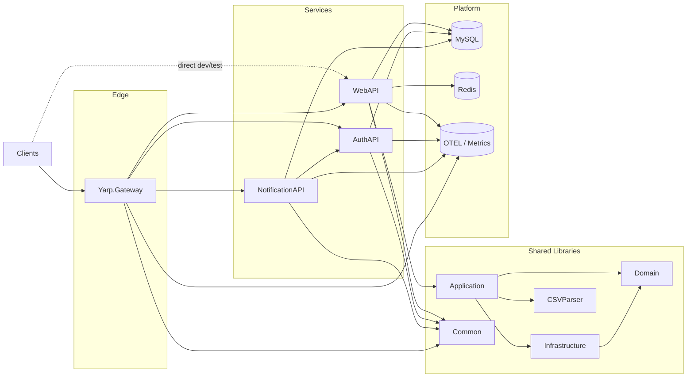
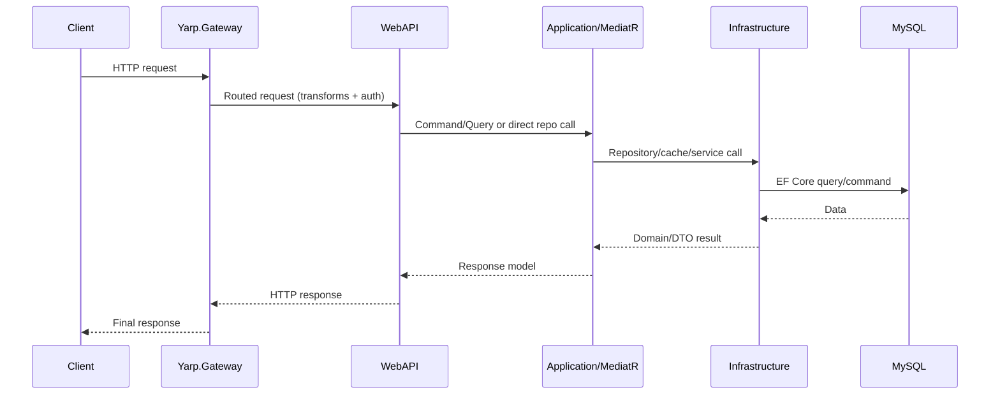
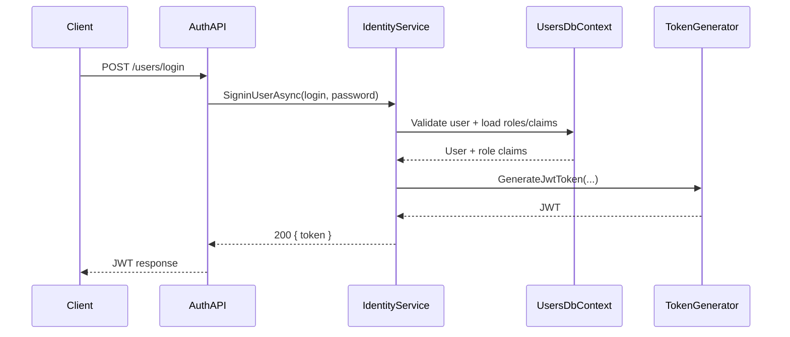
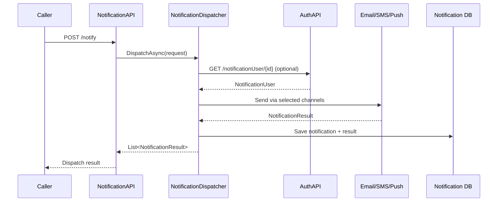
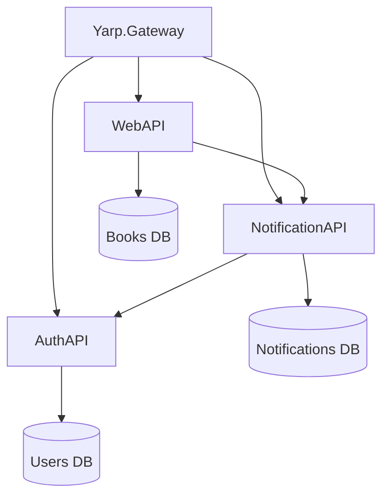

# Codebase Map

> Auto-generated by Cartographer. Last mapped: 2026-05-07T16:11:15Z

**Related artifacts**:
- Short reader report: [`../subagent_report_1.md`](../subagent_report_1.md)
- Actionable follow-up items: [`CARTOGRAPHER_FIX_LIST.md`](CARTOGRAPHER_FIX_LIST.md)

## System Overview

This repository is a .NET 8 multi-service backend organized around a books domain. The main `WebAPI` service exposes versioned book, author, and category endpoints, while `Application`, `Domain`, and `Infrastructure` implement CQRS handlers, domain entities/events, persistence, caching, and telemetry.

`AuthAPI` provides ASP.NET Identity-based user management and JWT issuance, `NotificationAPI` dispatches notifications across multiple channels and depends on Auth for recipient lookup, and `Yarp.Gateway` fronts the services with reverse-proxy routing, Swagger aggregation, rate limiting, and shared authentication.

Operational support lives under `docker/` with MySQL, Redis, Prometheus, Grafana, Jaeger, and OTEL collector configuration. Testing is split into four projects under `Tests/`: `BooksAPI.UnitTests` for handlers/validators/repositories, `BooksAPI.IntegrationTests` for HTTP-level verification of the books API, `AuthAPI.UnitTests` for identity-service unit tests, and `AuthAPI.IntegrationTests` for auth endpoint coverage.

## Directory Structure

| Path | Est Tokens | Purpose |
|---|---:|---|
| `WebAPI/` | 42934 | Main books service host, versioned endpoints, middleware, and runtime logs |
| `Infrastructure/` | 23608 | EF Core persistence, repositories, cache services, ETag handling, migrations |
| `AuthAPI/` | 18755 | User/auth service with Identity, JWT issuance, migrations, seed data |
| `NotificationAPI/` | 14727 | Notification service, channel implementations, templates, persistence |
| `Application/` | 6660 | Commands, queries, validators, pipeline behaviors, DTOs |
| `.claude/` | 5777 | Local AI/cartographer skill config |
| `Tests/BooksAPI.IntegrationTests/` | 4985 | HTTP integration tests for `WebAPI` |
| `docker/` | 4810 | Compose files, Dockerfiles, OTEL/Prometheus/Grafana setup |
| `Yarp.Gateway/` | 4487 | Reverse proxy, Swagger aggregation, rate limiting, routing config |
| `Common/` | 4030 | Shared JWT and OpenTelemetry packages |
| `Tests/BooksAPI.UnitTests/` | 3198 | Handler, repository, and validator tests |
| `Domain/` | 2244 | Entities, domain events, validation helpers |
| `.github/` | 1710 | CI workflow definitions |
| `CSVParser/` | 1419 | Simple vs span-based CSV parsing implementations |

### Notes on token-heavy areas
- `WebAPI/` appears largest partly because runtime log files are checked into source control; `WebAPI/Minimal_API_20260403.log` alone accounts for a large share of the scanned tokens.
- EF migration designer/model snapshot files in `Infrastructure/`, `AuthAPI/`, and `NotificationAPI/` are generated and high-volume but low-value for daily navigation.

## Module Guide

### `WebAPI`

**Purpose**: Main books-facing HTTP service with API versioning, CRUD/CQRS endpoints, health/metrics, Swagger, and middleware.

**Entry points**:
- `WebAPI/Program.cs`
- `WebAPI/Endpoints.cs`
- `WebAPI/ApiDependencyInjection.cs`

**Key files**:

| File | Purpose | Tokens |
|---|---|---:|
| `WebAPI/Program.cs` | Host bootstrap, middleware, auth, health, metrics | 881 |
| `WebAPI/Endpoints.cs` | Versioned route definitions for books/authors/categories | 2679 |
| `WebAPI/ApiDependencyInjection.cs` | Swagger and API versioning setup | 601 |
| `WebAPI/Middleware/ErrorHandlerMiddleware.cs` | JSON error translation for unhandled exceptions | 268 |

**Dependencies**: `Application`, `Infrastructure`, `Common/JwtHelperService`, BenchmarkDotNet.

**Dependents**: `Yarp.Gateway`, integration tests, direct clients.

**Patterns**: Minimal APIs, mixed legacy repository-style v1 + CQRS v2, policy-based auth, endpoint filters, response caching.

### `Application`

**Purpose**: Books-service application layer with commands, queries, validators, DTOs, mappings, and MediatR behaviors.

**Entry points**:
- `Application/ApplicationDependencyInjection.cs`
- command/query handlers under `Application/Books/` and `Application/Authors/`

**Key files**:

| File | Purpose | Tokens |
|---|---|---:|
| `Application/ApplicationDependencyInjection.cs` | Registers validators, mapper, MediatR behaviors | 594 |
| `Application/Behaviors/CachingBehavior.cs` | Cache-aside MediatR behavior | 360 |
| `Application/Behaviors/ValidationBehavior.cs` | FluentValidation gate before handlers | 229 |
| `Application/Books/Create/CreateBookCommandHandler.cs` | CQRS book creation handler | 141 |
| `Application/Books/UploadCsv/UploadCsvCommandHandler.cs` | CSV upload command handler using `ParserSimple` | 209 |

**Dependencies**: `Domain`, repository abstractions, FluentValidation, MediatR, AutoMapper, `CSVParser`.

**Dependents**: `WebAPI`, unit tests.

**Patterns**: CQRS, request/handler separation, pipeline behaviors.

### `Domain`

**Purpose**: Shared books domain types, validation helpers, and domain events.

**Entry points**:
- entity constructors and validation attributes in `Domain/Entities/`

**Key files**:

| File | Purpose | Tokens |
|---|---|---:|
| `Domain/Entities/Author.cs` | Author entity with validation and domain event trigger | 477 |
| `Domain/Entities/Book.cs` | Book aggregate entity | 282 |
| `Domain/Validations/ISBNValidator.cs` | ISBN rules | 264 |

**Dependencies**: Mostly BCL/data annotations only.

**Dependents**: `Application`, `Infrastructure`, `CSVParser`, tests.

**Patterns**: Rich domain model, domain events, validation attributes.

### `Infrastructure`

**Purpose**: Books-service persistence and integration layer.

**Entry points**:
- `Infrastructure/InfrastructureDependencyInjection.cs`
- `Infrastructure/Repositories/BookStoreDbContext.cs`
- repositories and cache services under `Infrastructure/Repositories/` and `Infrastructure/Services/`

**Key files**:

| File | Purpose | Tokens |
|---|---|---:|
| `Infrastructure/InfrastructureDependencyInjection.cs` | Registers DB, repositories, Redis cache, email, parsers | 895 |
| `Infrastructure/Repositories/BookStoreDbContext.cs` | EF Core model, seed data, commit/event dispatch | 1945 |
| `Infrastructure/Repositories/BookRepository.cs` | Book CRUD/search/statistics/bulk import | 1764 |
| `Infrastructure/Services/HttpResponseEtagFiler.cs` | ETag + 304 endpoint filter | 363 |

**Dependencies**: EF Core MySQL provider, Redis, OpenTelemetry, `Application`, `Domain`.

**Dependents**: `WebAPI`, tests.

**Patterns**: Repository, decorator (`CachedAuthorRepository`), Unit of Work, cache abstraction.

### `AuthAPI`

**Purpose**: Identity/user service that issues JWT tokens and hosts user CRUD endpoints.

**Entry points**:
- `AuthAPI/AuthAPI.Api/Program.cs`
- `AuthAPI/AuthAPI.Api/Endpoints.cs`
- `AuthAPI/AuthAPI.Infrastructure/Repositories/UsersSeedService.cs`

**Key files**:

| File | Purpose | Tokens |
|---|---|---:|
| `AuthAPI/AuthAPI.Api/Program.cs` | Host bootstrap, auth, telemetry, seeding | 407 |
| `AuthAPI/AuthAPI.Api/Endpoints.cs` | Login + user CRUD endpoints | 541 |
| `AuthAPI/AuthAPI.Infrastructure/InfrastructureDependencyInjection.cs` | Identity/DB/repository wiring | 580 |
| `AuthAPI/AuthAPI.Infrastructure/Services/IdentityService.cs` | User/role operations and JWT issuance | 2431 |
| `AuthAPI/AuthAPI.Infrastructure/Repositories/UsersSeedService.cs` | Seed roles, claims, admin user | 1204 |

**Dependencies**: ASP.NET Identity, EF Core, `Common/JwtHelperService`, `Common/OpenTelemetryService`.

**Dependents**: `Yarp.Gateway`, `NotificationAPI`, callers requiring tokens.

**Patterns**: Identity service wrapper, startup seeding, claim-based auth.

### `NotificationAPI`

**Purpose**: Notification service that renders templates and dispatches through channel implementations.

**Entry points**:
- `NotificationAPI/NotificationAPI.Api/Program.cs`
- `NotificationAPI/NotificationAPI.Api/Endpoints.cs`
- `NotificationAPI/NotificationAPI.Infrastructure/Services/NotificationDispatcher.cs`

**Key files**:

| File | Purpose | Tokens |
|---|---|---:|
| `NotificationAPI/NotificationAPI.Api/Program.cs` | Host bootstrap and metrics/Swagger | 374 |
| `NotificationAPI/NotificationAPI.Api/Endpoints.cs` | Notify + notification status endpoints | 203 |
| `NotificationAPI/NotificationAPI.Application/NotificationApplicationDependencyInjection.cs` | App-layer options + AutoMapper wiring | 345 |
| `NotificationAPI/NotificationAPI.Infrastructure/InfrastructureDependencyInjection.cs` | Registers repos, channels, dispatcher, Auth API client | 655 |
| `NotificationAPI/NotificationAPI.Infrastructure/Services/NotificationDispatcher.cs` | Orchestrates recipient lookup, templating, rate limiting, channel execution | 1056 |

**Dependencies**: EF Core, shared telemetry, Auth API HTTP lookup, strategy-style channels.

**Dependents**: Gateway and any notification-producing clients.

**Patterns**: Channel strategy, template service, repository-backed status tracking.

### `Common`

**Purpose**: Shared packages reused by every host.

**Entry points**:
- `Common/JwtHelperService/JwtHelper.cs`
- `Common/OpenTelemetryService/OpenTelemetryExtensions.cs`

**Key files**:

| File | Purpose | Tokens |
|---|---|---:|
| `Common/JwtHelperService/JwtHelper.cs` | JWT auth + claim policy registration | 1070 |
| `Common/OpenTelemetryService/OpenTelemetryExtensions.cs` | Shared tracing/metrics bootstrap | 1477 |

**Dependencies**: ASP.NET auth, token validation, OpenTelemetry, Redis instrumentation.

**Dependents**: `WebAPI`, `AuthAPI`, `NotificationAPI`, `Yarp.Gateway`.

### `CSVParser`

**Purpose**: CSV parsing strategies used by book import endpoints and benchmark code.

**Key files**:

| File | Purpose | Tokens |
|---|---|---:|
| `CSVParser/ParserSimple.cs` | String-splitting parser | 380 |
| `CSVParser/ParserMemory.cs` | Span-based parser optimized for allocations | 609 |

**Dependencies**: `Domain`.

**Dependents**: `Application` CSV upload handlers.

### `Yarp.Gateway`

**Purpose**: Single ingress gateway with auth, routing, rate limiting, and Swagger aggregation.

**Entry points**:
- `Yarp.Gateway/Program.cs`
- `Yarp.Gateway/appsettings.json`

**Key files**:

| File | Purpose | Tokens |
|---|---|---:|
| `Yarp.Gateway/Program.cs` | Reverse proxy host bootstrap | 587 |
| `Yarp.Gateway/appsettings.json` | Routes, clusters, transforms, Swagger metadata | 1646 |
| `Yarp.Gateway/Configs/ConfigureSwaggerOptions.cs` | Builds Swagger docs from proxy config | 237 |
| `Yarp.Gateway/Extensions/SwaggerExtensions.cs` | Maps cluster config to Swagger docs/UI endpoints | 682 |

**Dependencies**: YARP, Swagger packages, shared JWT and telemetry helpers.

**Dependents**: external clients.

### `BooksAPI.IntegrationTests`

**Purpose**: End-to-end verification of HTTP contracts for the main books service.

**Entry points**:
- `Tests/BooksAPI.IntegrationTests/Configuration/CustomWebApplicationFactory.cs`
- `Tests/BooksAPI.IntegrationTests/BookApiTests.cs`

**Key files**:

| File | Purpose | Tokens |
|---|---|---:|
| `Tests/BooksAPI.IntegrationTests/Configuration/CustomWebApplicationFactory.cs` | Test host customization and schema reset | 641 |
| `Tests/BooksAPI.IntegrationTests/BookApiTests.cs` | Integration coverage for book endpoints | 1617 |

**Dependencies**: ASP.NET test host, `WebAPI`, EF Core, MySQL (Testcontainers).

### `BooksAPI.UnitTests`

**Purpose**: Lower-level verification of handlers, validators, repository behavior, and domain events.

**Key files**:

| File | Purpose | Tokens |
|---|---|---:|
| `Tests/BooksAPI.UnitTests/BookTests.cs` | Tests CQRS handlers, validators, domain event behavior | 2691 |

**Dependencies**: xUnit, Moq, application/infrastructure types.

### `AuthAPI.UnitTests`

**Purpose**: Unit tests for `AuthAPI.Infrastructure.Services.IdentityService` — login, user creation, role management, and validation.

**Key files**:

| File | Purpose | Tokens |
|---|---|---:|
| `Tests/AuthAPI.UnitTests/IdentityServiceTests.cs` | Tests IdentityService methods with Moq | ~800 |
| `Tests/AuthAPI.UnitTests/Helpers/AuthApiMockHelper.cs` | Shared mock factory for UserManager/SignInManager/RoleManager | ~280 |

**Dependencies**: xUnit, Moq, `AuthAPI.Infrastructure`, `AuthAPI.Domain`, `JwtHelperService`.

### `AuthAPI.IntegrationTests`

**Purpose**: End-to-end HTTP contract tests for auth endpoints.

**Key files**:

| File | Purpose | Tokens |
|---|---|---:|
| `Tests/AuthAPI.IntegrationTests/Configuration/AuthApiWebApplicationFactory.cs` | Test host with MySQL Testcontainer | ~400 |
| `Tests/AuthAPI.IntegrationTests/AuthEndpointsIntegrationTests.cs` | Login, user CRUD, and auth flows | ~600 |

**Dependencies**: ASP.NET test host, `AuthAPI.Api`, MySQL (Testcontainers).

### `docker`

**Purpose**: Local observability and infrastructure topology.

**Key files**:

| File | Purpose | Tokens |
|---|---|---:|
| `docker/docker-compose.yaml` | Brings up OTEL, Prometheus, Grafana, MySQL, Redis, Jaeger | 975 |
| `docker/*.Dockerfile` | Build container images for individual services | varied |

## Data Flow

### Request flow: client to books service

### Identity and token flow

### Notification dispatch flow

### Service relationship snapshot

## Conventions

- **Layering**: `Application` contains orchestration logic, `Domain` contains core types/rules, `Infrastructure` contains implementations, service hosts compose them.
- **Endpoint style**: minimal APIs everywhere; controllers are not the primary HTTP model.
- **Versioning**: `WebAPI` uses URL/query/header API version readers and serves both deprecated v1 and active v2.
- **CQRS**: v2 books endpoints go through MediatR handlers and validators; v1 still uses repository endpoints directly.
- **Authorization**: centralized in `Common/JwtHelperService` via claim-based policies.
- **Observability**: all hosts wire shared OpenTelemetry tracing/metrics and expose health/metrics endpoints.
- **Caching**: query-level caching via MediatR pipeline behavior and HTTP-level caching via ETag endpoint filters.

## Gotchas

- `WebAPI/Endpoints.cs` likely contains an inverted null check for v2 `GET /books/{id}` and may return `404` for existing books.
- `WebAPI` search endpoint in v1 ignores the caller-supplied `pageSize` and always uses `10`.
- `BookRepository.AddAsync(BookDto)` commits but returns `null`, which is surprising for callers that expect the created entity.
- `NotificationAPI` requires auth on one endpoint but comments out `UseAuthentication()` / `UseAuthorization()` in `Program.cs`.
- `NotificationDispatcher` mixes async and blocking calls (`.Result`) and includes unreachable code after `return null`.
- Auth login takes credentials through query parameters, which is easy to leak in logs, browser history, and proxies.
- `IntegrationTests` currently depend on Testcontainers (MySQL) and require Docker — they are not run in the local unit-test suite.
- Localhost service URLs are scattered across the gateway and service HTTP clients; environment portability depends on config discipline.
- Runtime logs and generated migration files add substantial repo size/noise for both humans and mapping tools.

## Follow-up Fix List

The prioritized action list is maintained in [`CARTOGRAPHER_FIX_LIST.md`](CARTOGRAPHER_FIX_LIST.md).

Top items from that list:
1. Fix the likely inverted null check in `WebAPI/Endpoints.cs` for v2 `GET /books/{id}`.
2. Resolve `BookRepository.AddAsync(BookDto)` returning `null` after commit.
3. Reconcile notification endpoint authorization with disabled auth middleware.
4. Remove sync-over-async and unreachable code in `NotificationDispatcher`.
5. Move sensitive/default auth login patterns and embedded credentials toward safer defaults.

## Navigation Guide

**To add a new books API endpoint**
1. Start in `WebAPI/Endpoints.cs`.
2. For v2, add a request/handler/validator in `Application/Books/`.
3. Extend repository/service code in `Infrastructure/` if data access changes.
4. Add unit and/or integration tests in `Tests/BooksAPI.UnitTests` or `Tests/BooksAPI.IntegrationTests`.

**To add a new CQRS command/query**
1. Create request and handler under `Application`.
2. Add FluentValidation validator if needed.
3. Update mappings/DTOs.
4. Expose via `WebAPI/Endpoints.cs`.

**To modify auth**
1. Update policies/claim constants in `Common/JwtHelperService`.
2. Update seed claims/roles in `AuthAPI/AuthAPI.Infrastructure/Repositories/UsersSeedService.cs`.
3. Verify `Program.cs` for each service actually enables auth middleware.

**To modify caching behavior**
1. Check `Application/Behaviors/CachingBehavior.cs` and `CacheInvalidationBehavior.cs`.
2. Review `Infrastructure/Services/RedisCacheService.cs` / in-memory cache alternative.
3. Review HTTP caching in `Infrastructure/Services/HttpResponseEtagFiler.cs` and `WebAPI/Endpoints.cs`.

**To modify notification delivery**
1. Start at `NotificationAPI/NotificationAPI.Infrastructure/Services/NotificationDispatcher.cs`.
2. Add/adjust channel implementations under `NotificationAPI/NotificationAPI.Infrastructure/Channels/`.
3. Update template/repository services if message shape changes.

**To change gateway routing**
1. Edit `Yarp.Gateway/appsettings*.json`.
2. Validate proxy auth/rate-limit implications in `Yarp.Gateway/Program.cs`.
3. Check Swagger aggregation behavior in `Configs/ConfigureSwaggerOptions.cs` and `Extensions/SwaggerExtensions.cs`.

**To update schema/migrations**
1. Edit entities and the relevant DbContext.
2. Generate migrations under the corresponding infrastructure project.
3. Re-run integration tests and service startup validation.

## Skipped / Condensed Areas

- `**/*.log`, `.run/**`, `scanner.json`, and `tools/scan_codebase.py` were intentionally treated as noise/tooling rather than runtime architecture.
- EF migration designer/model snapshot files were summarized at module level only.
- `.claude/skills/cartographer/**` and `.github/workflows/**` were summarized rather than mapped file-by-file.
